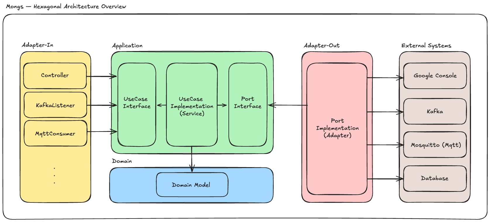

# 🚀 Monglife Mongs

[Mongs : 걸음 수로 키우는 다마고치](https://play.google.com/store/apps/details?id=com.mongs.wear) 서비스를 위한 서버 기능을 ***헥사고날 아키텍처***로 구현한 프로젝트 입니다.

## 🛠 System Architecture


## 🏗 Project Overview

### 1. Bootstrap Module
```Adapter In``` 모듈을 조합하여 ```Spring Boot Application``` 을 구동하는 모듈입니다.

| 구분                    | 역할                                                            |
|-----------------------|---------------------------------------------------------------|
| Character Application | 게임 캐릭터에 대한 기능을 정의한 Adapter In 모듈을 포함한 Spring Boot Application |
| User Application      | 플레이어에 대한 기능을 정의한 Adapter In 모듈을 포함한 Spring Boot Application   |

---
### 2. Adapter In
```Application``` 모듈의 ```UseCase Interface```를 통해 기능을 동작하고, 서비스의 ```EndPoint```를 담당합니다. 

| 구분             | 역할                   |
|----------------|----------------------|
| Controller     | Http 요청 및 응답         |
| Kafka Listener | 분산 트랜잭션 이벤트 소비       |
| Mqtt Consumer  | 클라이언트로부터 MQTT 메시지 수신 |

- 유스케이스 추상화 클래스(Interface)를 통한 요청 및 응답을 처리하는 로직 구현

---
### 3. Application Module
```Adapter Out``` 모듈의 ```Port Interface```를 통해 ```UseCase Interface```의 비즈니스 로직을 구현하는 모듈입니다.

| 구분      | 종류        | 역할                    |
|---------|-----------|-----------------------|
| UseCase | interface | 유스케이스 추상화 클래스         |
| Service | class     | 유스케이스 구현 클래스          |
| Port    | interface | 외부 시스템 연계를 위한 추상화 클래스 |

- 유스케이스 구현 클래스의 컴포넌트화를 위해 ```Spring```에 대한 의존성을 가짐
- 여러 도메인을 조합하여 비즈니스 로직 구현

---
### 4. Domain Module
```Domain Model``` 에 대한 비즈니스 로직을 구현하는 모듈입니다. 

- Java 에 대한 의존성만을 가지는 모듈
- 도메인 객체에 대한 비즈니스 로직을 구현하는 모듈

---
### 5. Adapter Out
```Application``` 모듈의 ```Port Interface```를 구현하는 모듈입니다. ```External System``` 과 통신을 담당합니다.

| 구분                  | 종류    | 역할                 |
|---------------------|-------|--------------------|
| Persistence Service | class | DB 영속화             |
| Read Service        | class | DB 조회 (read only)  |
| Event Service       | class | 분산 트랜잭션 이벤트 발생     |
| Publish Service     | class | 클라이언트로 MQTT 메시지 전송 |
| Schedule Service    | class | 정기 스케줄러 관리         |


---
### 6. External System
본 서비스에서 사용중인 외부 시스템 목록입니다.

| 구분               | 설명                       |
|------------------|--------------------------|
| Google Console   | 인앱 상품 정보 및 결제를 위한 외부 시스템 |
| Kafka            | 분산 트랜잭션 처리를 위한 외부 시스템    |
| Moquitto (MQTT)  | 비동기 통신을 위한 외부 시스템        |
| Database (MYSQL) | 데이터 저장을 위한 외부 시스템        |

