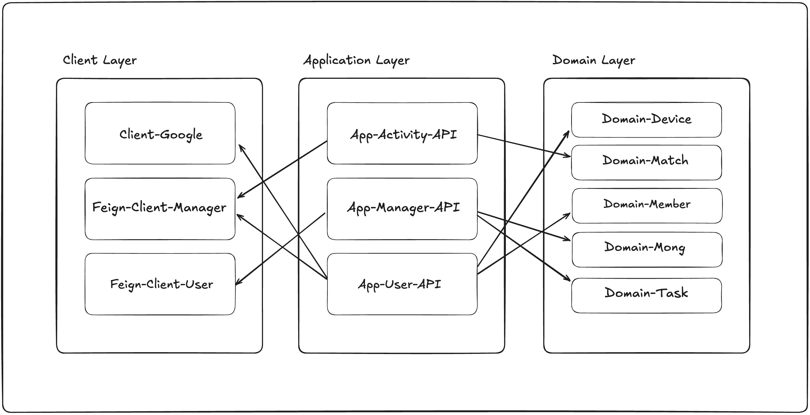

# 🚀 Monglife Discovery

[Mongs : 걸음 수로 키우는 다마고치](https://play.google.com/store/apps/details?id=com.mongs.wear) 서비스를 위한 기능들을 구현한 프로젝트 입니다.

## 🏗 Project Overview

### - Application Layer (애플리케이션 레이어)
서비스의 ```EndPoint```를 담당하는 레이어입니다. 기본적으로 ````Controller```` 또는 ```Consumer```가 위치해 있으며, ```HTTP``` 요청을 받는 역할을 하는 모듈이 있습니다.  ```Domain Layer```의 모듈에 의존하여 비즈니스 로직을 구현합니다. 다른 ```Application``` 모듈로 요청을 보내야 하는 경우, ```Client Layer```의 모듈에 의존하여 모듈 간 통신을 하도록 구현되어 있습니다. 

#### Activity API
- ```캐릭터 배틀```,```캐릭터 훈련```의 기능을 구현한 API 모듈입니다.

#### Manager API
- ```먹이주기```,```수면/기상```,```진화```,```졸업```등 캐릭터와의 상호작용 및 관리 기능을 구현한 API 모듈입니다.

#### User API
- ```플레이어 현금성 아이템 관리```,```플레이어 정보 관리```등 플레이어와 관련된 정보를 관리하는 기능을 구현한 API 모듈입니다.

### - Domain Layer (도메인 모듈 레이어)
각 모듈별로 맡은 도메인을 관리하는 레이어입니다. 본 레이어에서는 다른 도메인에 의존하지 않으며, 각자 맡은 도메인에만 집중하기 위해 별도의 모듈로 분리하였습니다.
각 모듈은 최대한 자신의 ````Domain````인 ````Entity````를 외부 모듈로 노출하지 않도록 하였습니다.

#### Device Domain
- 플레이어의 모바일 기기에 저장되고 ````Mongs````서비스에서 사용되는 정보들을 관리하는 모듈입니다.
- [Monglife Discovery](https://github.com/monglife/monglife-discovery)의 ```Device Domain```과는 다르게 본 서비스에서만 사용되는 모바일 기기 정보들을 관리합니다.
- 대표적으로 기기에 저장된 걸음 수를 관리하며, 안드로이드 기기 특성 상 재부팅이 되는 경우 축적된 걸음 수가 초기화되는 문제점을 해결하기 위해 개발되었습니다.

#### Match Domain
- ```캐릭터 간 배틀```기능의 배틀 매치 데이터를 관리하는 모듈입니다.
- ```spring-starter-jpa``` 에 의존하며 배틀 매치에 대한 데이터를 직접적으로 관리합니다.
- 캐릭터 간 배틀 전 진행하는 매칭 기능을 담당하며 배틀할 때, 플레이어의 ```공격```,```수비```와 같은 선택 값들을 관리합니다.

#### Member Domain
- 플레이어에 대한 데이터를 관리하는 모듈입니다.
- ```spring-starter-jpa``` 에 의존하며 데이터베이스에 연결되어 플레이어에 대한 데이터를 직접적으로 관리합니다.
- 플레이어으 상태가 변경되면 ````Entity Listener````의 ```@PreUpdate```를 통해 감지하고 ```Spring Event```를 발생시킵니다.

#### Mong
- 캐릭터에 대한 데이터를 관리하는 모듈입니다.
- ```spring-starter-jpa``` 에 의존하며 데이터베이스를 연결하여 케릭터에 대한 데이터를 직접적으로 관리합니다.
- 캐릭터의 지수, 상태에 대한 정보를 관리하고 진화 상태 감지와 같이 상태 변경을 확인하여 처리합니다.
- 캐릭터의 상태가 변경되면 ````Entity Listener````의 ```@PreUpdate```를 통해 감지하고 ```Spring Event```를 발생시킵니다.
- 상위 ```Application Layer```에서는 캐릭터 변경 ```Spring Event```를 감지하여 상태에 따른 로직을 처리합니다.

#### Task
- 일정 주기로 반복되는 작업 실행, 특정 시간에 실행되는 작업 실행을 할 수 있도록 구현되었습니다.
- 캐릭터의 생명주기를 관리하는 스케줄러를 가동하기 위해 사용합니다.
- 스케줄러가 종료되거나 실행되는 경우에 ```Spring Event```를 발생시킵니다.
  - 1. 특정 시간 이후 Task 발생 이벤트
    ```java
    /**
        특정 시간 이후 발생 이벤트 
    */
    public class ExecuteTaskEvent {
        private final String appPackageName;
        private final String taskOwnerId;
        private final String taskCode;
        private final LocalDateTime expiredAt;
        private final Long expirationSeconds;
    }
    
    /**
        특정 시간 이후 발생 이벤트 리스너 
    */
    @EventListener
    public void executeTaskEventListener(ExecuteTaskEvent event) {
        // TODO: do something 
    }
    ```
  - 2. 특정 시간 마다 반복 Task 발생 이벤트
    ```java
    /**
        특정 시간 마다 반복 발생 이벤트 
    */
    public class ExecuteCycleTaskEvent {
        private final String appPackageName;
        private final String taskOwnerId;
        private final String taskCode;
        private final LocalDateTime expiredAt;
        private final Long expirationSeconds;
    }
    
    /**
        특정 시간 마다 반복 발생 이벤트 리스너 
    */
    @EventListener
    public void executeCycleTaskEventListener(ExecuteCycleTaskEvent event) {
        // TODO: do something 
    }    
    ```
  - 3. 특정 시간 이후 발생하는 Task 삭제(중지) 이벤트
    ```java
    /**
        특정 시간 이후 발생하는 Task 삭제 이벤트 
    */
    public class DeleteTaskEvent {
        private final String appPackageName;
        private final String taskOwnerId;
        private final String taskCode;
        private final LocalDateTime expiredAt;
        private final Long expirationSeconds;
    }
    /**
        특정 시간 이후 발생하는 Task 삭제이벤트 리스너 
    */
    @EventListener
    public void deleteTaskEventListener(DeleteTaskEvent event) {
        // TODO: do something 
    }    
    ```
  - 4. 특정 시간 마다 반복 발생하는 Task 삭제(중지) 이벤트
    ```java
    /**
        특정 시간 마다 발생하는 Task 삭제 이벤트 
    */
    public class DeleteCycleTaskEvent {
        private final String appPackageName;
        private final String taskOwnerId;
        private final String taskCode;
        private final LocalDateTime expiredAt;
        private final Long expirationSeconds;
    }
    /**
        특정 시간 마다 발생하는 Task 삭제 이벤트 리스너 
    */
    @EventListener
    public void deleteCycleTaskEventListener(DeleteCycleTaskEvent event) {
        // TODO: do something 
    }    
    ```

### - Client Layer (외부 통신 레이어)
본 레이어는 ````Application Layer````에서의 다른 모듈로의 요청 및 응답이나, 외부 API와의 통신을 위한 모듈을 분리한 레이어입니다.

#### Google Client
- Google 인앱 결제를 위해 개발된 모듈입니다.
- ```인앱 결제 검증```,```인앱 구매 항목 조회```,```영수증 조회```기능을 담당하며, ```Google Play```와의 통신을 통해 인앱 결제 전반적인 기능을 구현했습니다.

#### Manager Feign Client
- ```Manager API```로의 ```Feign Client```통신을 위한 모듈입니다.
- ```Manager API```를 제외한 ```Application Layer```의 모듈에서 캐릭터 정보를 변경할 때 사용됩니다.

#### User Feign Client
- ```User API```로의 ```Feign Client```통신을 위한 모듈입니다.
- ```User API```를 제외한 ```Application Layer```의 모듈에서 플레이어의 정보를 변경할 때 사용됩니다.

## 🛠 System Architecture
